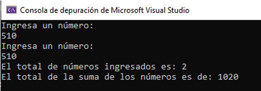

# Conteo_Enteros_sum-1000_OR-sum-1000
El programa leerá números enteros hasta que la suma de todos sea igual o mayor a 1000, mostrará un resumen.

### Instrucciones: 
+Realiza el análisis, diseño e implementación de un programa que lea del teclado números enteros y los vaya sumando. 
+Debe detenerse cuando la suma de los números leídos sea 1000 o más.
+Mostrar el total de la suma y la cantidad de números que se sumaron.

### Tecnologías utilizadas: 
**Microsoft Visual Studio:** Para desarrollar el código del programa.

### El programa deberá presentar una pantalla similar a la siguiente después de compilarse:

